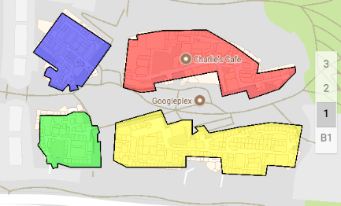

## SushiHangover.Android.Maps.Utils

**Handy extensions to the Google Maps Android API.**

Xamarin Android Binding Library for [Google Maps Android API Utility Library](https://developers.google.com/maps/documentation/android-api/utility/
)

## Current project status:

## Nuget:

<code>
PM> Install-Package SushiHangover.Android.Maps.Utils
</code>

Ref: [https://www.nuget.org/packages/SushiHangover.Android.Maps.Utils](https://www.nuget.org/packages/SushiHangover.Android.Maps.Utils)

## Demo

I did *not* port the Java sample in the Google Repo to C#, would love a pull-request ;-)

I am using a number of the classes/methods in a few of projects so I know the "basics" work... If there are any methods that are returning `Java.Lang.Object` vs. a more formal concrete class, post an issue or even better, a pull-reuquest ;-)

### A Demo Snippet:

~~~
var kmlLayer = new KmlLayer(googleMap, Resource.Raw.campus, ApplicationContext);
kmlLayer.AddLayerToMap();
MoveCameraToKml(kmlLayer);
~~~
	
	void MoveCameraToKml(KmlLayer kmlLayer)
	{
		//Retrieve the first container in the KML layer
		var container = (KmlContainer)kmlLayer.Containers.Iterator().Next();
		//Retrieve a nested container within the first container
		container = (KmlContainer)container.Containers.Iterator().Next();
		//Retrieve the first placemark in the nested container
		var placemark = (KmlPlacemark)container.Placemarks.Iterator().Next();
		//Retrieve a polygon object in a placemark
		var polygon = (KmlPolygon)placemark.Geometry;
		//Create LatLngBounds of the outer coordinates of the polygon
		LatLngBounds.Builder builder = new LatLngBounds.Builder();
		foreach (LatLng latLng in polygon.OuterBoundaryCoordinates)
		{
			builder.Include(latLng);
		}
	    googleMap.MoveCamera(CameraUpdateFactory.NewLatLngBounds(
			builder.Build(), mapFragment.View.Width, mapFragment.View.Height, 1)
		);
	}

## Issues?

### Post issues on [GitHub](https://github.com/sushihangover/SushiHangover.Android.Maps.Utils/issues)

## Need Help?

Post on [StackOverflow](http://stackoverflow.com/questions/tagged/xamarin+Xamarin.Android+google-maps) with the tags: **`[xamarin]`** **`[xamarin.android]`** **`[google-maps]`**

## Github Repo:

Library: [https://github.com/googlemaps/android-maps-utils](https://github.com/googlemaps/android-maps-utils)

Binding: [https://github.com/sushihangover/SushiHangover.Android.Maps.Utils](https://github.com/sushihangover/SushiHangover.Android.Maps.Utils)